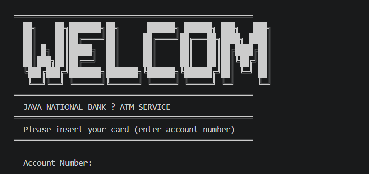
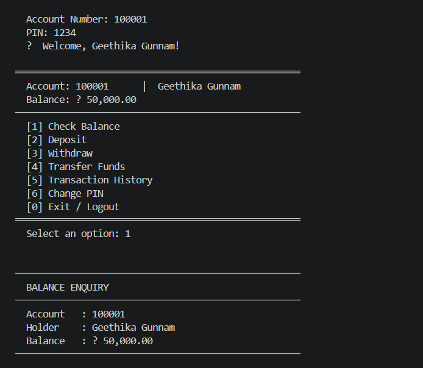

# ATM Interface System using Java
A console-based ATM Management System developed using Java and Object-Oriented Programming principles. This project simulates core ATM functionalities such as user authentication, balance enquiry, deposit, withdrawal, fund transfer, transaction history, and PIN management.
## Features
- User Login Authentication
- Check Account Balance
- Deposit Money
- Withdraw Money
- Transfer Funds
- Transaction History
- Change PIN
- Account Lock After Failed Attempts
- Persistent Data Storage using File Handling
- Clean Console-Based User Interface
## Technologies Used
- Java
- Object-Oriented Programming (OOP)
- File Handling
- Collections Framework
- VS Code
- Git & GitHub
## OOP Concepts Used
- Encapsulation
- Abstraction
- Composition
- Separation of Concerns
## Project Structure
- ATMAPP.java → Application entry point
- ATM.java  → Core ATM operations
- Bank.java → Account management and storage
- Account.java → Account model and balance operations
- Transaction.java  → Transaction record management
- Display.java → Console UI and output formatting
- InputHandler.java  → User input handling and validation
## Functionalities
- Secure login using account number and PIN
- Real-time balance updates
- Money deposit and withdrawal operations
- Fund transfer between accounts
- Transaction history tracking
- PIN change functionality
- Session handling and validation
- File-based persistent account storage
## How to Run
1. Open the project in VS Code
2. Compile all Java files
3. Run `ATMAPP.java`
4. Enter account number and PIN
5. Use the ATM menu options
## Sample Login Credentials
| Account Number | PIN |
|---|---|
| 100001 | 1234 |
| 100002 | 5678 |
## Screenshots
### Welcome Screen

### Main Menu

### Check Balance

## Future Improvements
- Database Integration using MySQL
- GUI Version using Java Swing or JavaFX
- Receipt Generation
- Admin Dashboard
- Mini Statement Export
- Email/SMS Notifications
## Author
**Gunnam Geethika**
